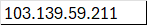

# Nexole WAF Documentation

Welcome to the Nexole Web Application Firewall (WAF) documentation. This guide will help you understand and use the various features of Nexole WAF to protect your web applications and APIs.

## Comprehensive Documentation

### User Manual

The [Nexole WAF User Manual](./nexole_waf_user_manual.md) provides a complete overview of all features in the system. For detailed usage instructions on each specific page, please refer to the [Page Guides](./page_guides.md).

### Page Guides

Detailed instructions for each section of the Nexole WAF interface are available in the [Page Guides](./page_guides.md) directory. These guides provide in-depth explanations of features, best practices, and usage tips.

### Domain Management Documentation

Domain management is a core feature of Nexole WAF that allows you to add, configure, and monitor the protection of your websites and applications.

- [Domain Management Guide](./domain_management_guide.md) - Overview of the domain management feature
- [Domain Management Workflow](./domain_management_workflow.md) - Step-by-step workflow with screenshots
- [Domain Troubleshooting](./domain_troubleshooting.md) - Solutions for common issues
- [Domain Security Best Practices](./domain_security_best_practices.md) - Recommended security configurations

### Deployment Guide

For system administrators looking to deploy Nexole WAF on their infrastructure, the [Deployment Guide for Ubuntu](./deployment_guide_ubuntu.md) provides detailed installation and configuration instructions.

## Features Overview

### Core Protection Features

Nexole WAF provides comprehensive protection through:

- **WAF Rules Engine** - Rule-based detection and blocking of common web attacks
- **Geo-Blocking** - Country-based traffic filtering
- **Bot Protection** - Detection and blocking of malicious bots
- **Rate Limiting** - Prevention of brute force and DDoS attacks
- **ML-Based Anomaly Detection** - Machine learning powered attack detection
- **Threat Intelligence** - Integration with multiple threat intelligence feeds

### Management Features

- **Multi-Domain Management** - Protect and manage multiple websites from a single interface
- **Real-Time Monitoring** - View traffic and attacks in real time
- **Customizable Rules** - Create and modify security rules to match your needs
- **Advanced Analytics** - Understand attack patterns and traffic trends
- **User Management** - Role-based access control for team members

## Getting Started

1. **Account Setup** - Create and configure your administrator account
2. **Domain Management** - Add your first domain using the [Domain Management Workflow](./domain_management_workflow.md)
3. **Security Configuration** - Configure security settings based on [Best Practices](./domain_security_best_practices.md)
4. **Monitor and Adjust** - Use the dashboard to monitor traffic and adjust settings as needed

## Screenshots

### Dashboard Overview

### Domain Management

### Add Domain Form

### Security Configuration

## Support and Additional Resources

- For technical support, contact support@nexole.com
- Check our blog for the latest security advisories and WAF updates
- Join our community forum to discuss best practices with other Nexole WAF users