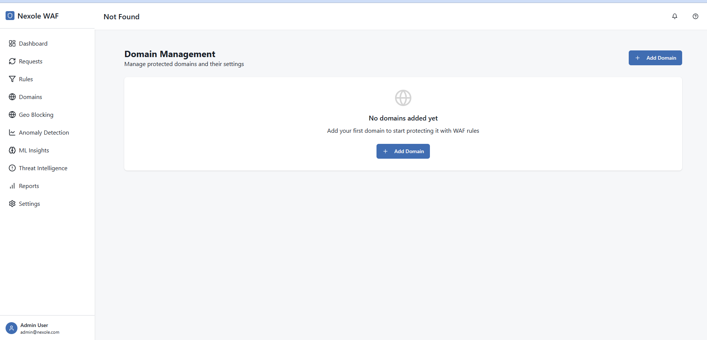
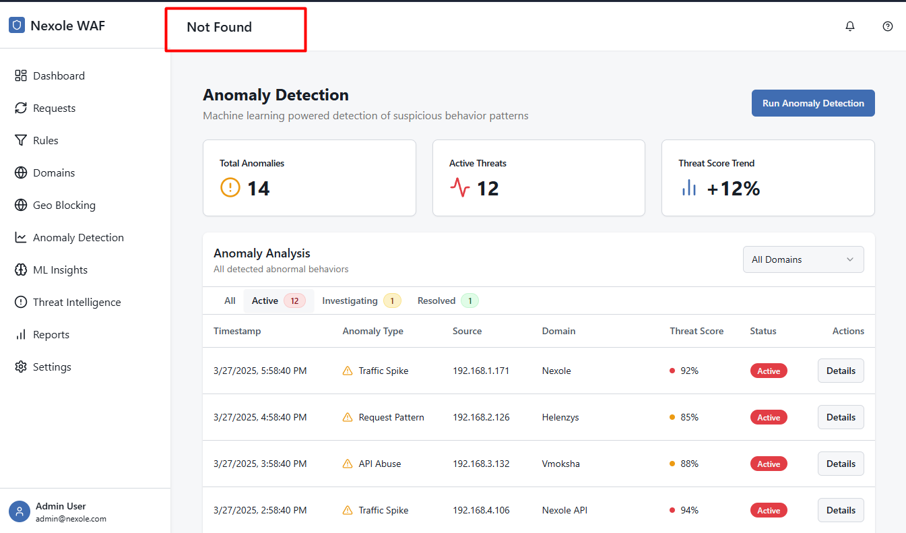
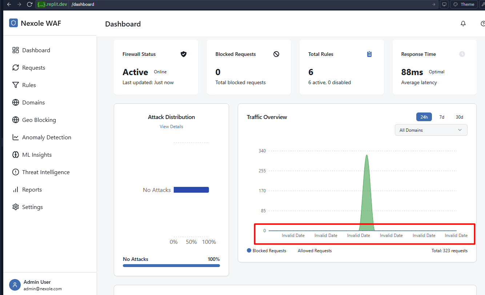
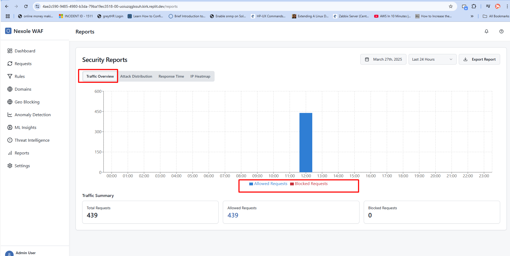

# Nexole WAF - Domain Management Workflow

This document provides a step-by-step guide with screenshots for managing domains in the Nexole WAF.

## Navigation to Domains Page

1. Log in to your Nexole WAF dashboard
2. Click on "Domains" in the sidebar menu

## Domain Overview Page

The Domain Overview page displays all your currently protected domains with details and status information:

Key elements:
- Each domain card shows the domain name, URL, and status
- Traffic statistics show allowed vs. blocked requests
- Security features indicators show what protections are active
- Action buttons allow quick editing, viewing logs, or deleting domains

## Adding a New Domain

### Step 1: Navigate to the Add Domain Form

From the Domains page, click the "Add Domain" button in the top right corner:

### Step 2: Fill in Basic Information

You'll be taken to the Add Domain form which uses a tabbed interface:

Basic Information tab fields:
- Domain Name: Enter a descriptive name (e.g., "Corporate Website")
- URL: Enter the domain URL (e.g., "https://example.com")
- Target IP: Enter the origin server IP (optional)
- DNS Provider: Select your DNS provider from the dropdown
- Description: Add any additional notes (optional)
- Active Protection: Toggle on to enable WAF protection

### Step 3: View DNS Record Guidance

Click "Show" next to DNS Record Guidance to see instructions for your DNS configuration:

The guidance provides:
- Specific record types needed (A, CNAME)
- Values to use for each record
- TTL recommendations
- Provider-specific instructions based on your selected DNS provider

### Step 4: Configure Security Settings

Click on the "Security Settings" tab to configure protection features:

Configure the following:
- Apply WAF Rules: Toggle on to enable WAF rule protection
- Select Security Rules: Choose which security rules to apply
- Geo Blocking: Toggle on to enable geographic blocking
- Blocked Countries: Select countries to block (visible when Geo Blocking is on)
- Bot Protection: Toggle on to enable bot detection and blocking
- SSL Verification: Toggle on to enforce SSL/TLS security

For Geo Blocking, you'll see an interactive world map to select countries:

### Step 5: Configure ML Protection

Click on the "ML Protection" tab to configure machine learning features:

Configure the following:
- ML Protection: Toggle on to enable machine learning protection
- ML Sensitivity: Select Low, Medium, or High sensitivity level
- Auto-Apply ML Rules: Toggle on to automatically apply ML-generated rules
- Threat Intelligence: Toggle on to enable threat intelligence features
- Threat Intelligence Feeds: Select which threat feeds to use (visible when Threat Intelligence is on)

### Step 6: Configure Advanced Settings

Click on the "Advanced Settings" tab for additional configuration options:

Configure the following:
- Monitor False Positives: Toggle on to enable false positive detection
- Rate Limiting: Toggle on to enable request rate limiting
- Requests Per Minute: Set the maximum allowed requests per minute (visible when Rate Limiting is on)

### Step 7: Save the Domain Configuration

After configuring all settings, click the "Add Domain" button at the bottom of the form to save your configuration.

## Editing an Existing Domain

### Step 1: Navigate to the Domain Edit Form

From the Domains page, click the pencil icon on the domain card you want to edit:

### Step 2: Update Domain Information

The edit form will open with the current domain settings pre-populated. Make your changes in any of the tabs.

### Step 3: Save Your Changes

After making your changes, click the "Save Changes" button at the bottom of the form.

## Deleting a Domain

### Step 1: Initiate Domain Deletion

From the Domains page, click the trash icon on the domain card you want to delete:

### Step 2: Confirm Deletion

A confirmation dialog will appear. Click "Delete" to confirm or "Cancel" to abort the deletion.

**Warning:** Deleting a domain will remove all its protection settings and stop the WAF from filtering traffic for that domain.

## Monitoring Domain Traffic

From the Domains page, click on the "View Logs" button on a domain card to see detailed traffic logs for that specific domain.

## Next Steps

After adding and configuring your domains:
1. Verify your DNS configuration to ensure traffic is properly routed through the WAF
2. Monitor the traffic on the Dashboard to ensure protection is working as expected
3. Review and adjust security rules if needed based on false positives or missed attacks
4. Set up notifications and reports for security events related to your domains