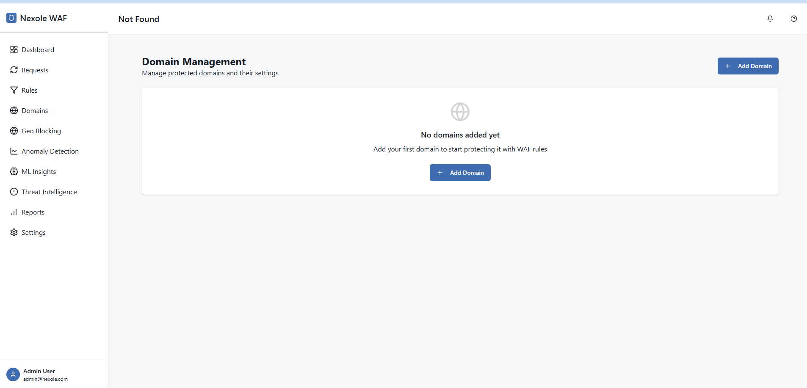
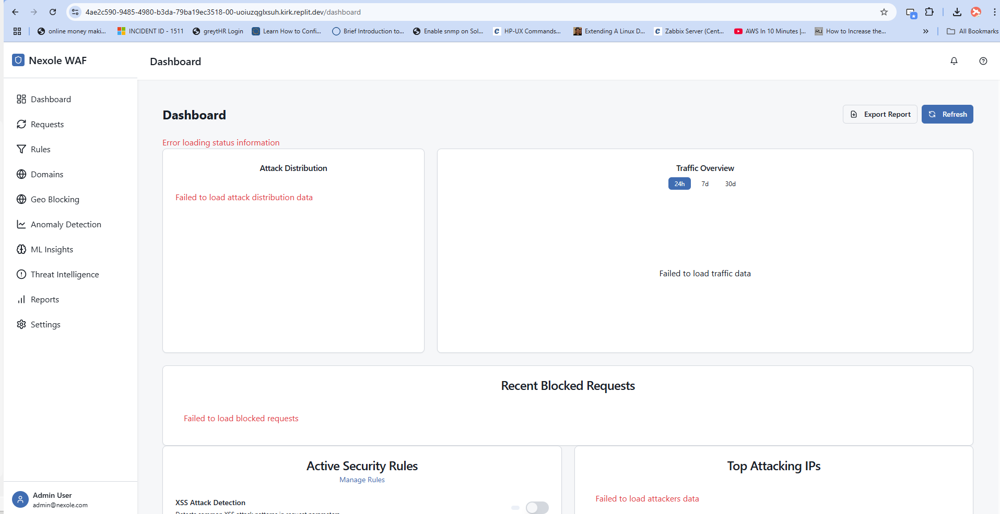
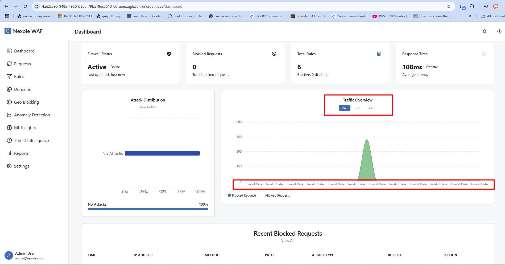

# Nexole WAF User Manual

**Version:** 1.0  
**Last Updated:** March 28, 2025

## Table of Contents

1. [Introduction](#introduction)
2. [Login & Authentication](#login--authentication)
3. [Dashboard](#dashboard)
4. [Requests](#requests)
5. [Rules](#rules)
6. [Domains](#domains)
7. [Geo Blocking](#geo-blocking)
8. [Anomaly Detection](#anomaly-detection)
9. [ML Insights](#ml-insights)
10. [Threat Intelligence](#threat-intelligence)
11. [Threat Map](#threat-map)
12. [Reports](#reports)
13. [Settings](#settings)

## Introduction

Nexole WAF is a comprehensive web application firewall that provides intelligent, real-time cyber threat protection with advanced security management capabilities. This document provides a detailed guide to using the Nexole WAF system efficiently.

## Login & Authentication

Access to Nexole WAF is protected by an authentication system. Users must log in with valid credentials before accessing any features.

**Features:**
- Secure login with username and password
- Registration for new users (requires admin approval)
- Password reset functionality (through admin)

**Default Admin Credentials:**
- Username: admin@nexole.com
- Password: Admin123!

## Dashboard

The Dashboard provides an overview of your security posture and key metrics at a glance.

**Key Components:**
- Traffic overview with blocked vs. allowed requests
- Recent attacks and security events
- System health metrics
- Anomaly detection indicators
- Quick access to critical functions

**Usage Tips:**
- Use the time period selector to view data for different timeframes
- Hover over charts for detailed information
- Click on alert indicators to navigate to detailed views

**Detailed Guide:** [Dashboard Guide](./page_guides/dashboard_guide.md)

## Requests

The Requests page allows you to monitor and analyze all HTTP traffic passing through the WAF.

**Key Components:**
- Filterable list of all HTTP requests
- Detailed request information (headers, body, etc.)
- Security classification (blocked/allowed)
- Rule match information

**Usage Tips:**
- Use filters to find specific types of requests
- Export data for forensic analysis
- Analyze patterns to identify potential attack vectors

**Detailed Guide:** [Requests Guide](./page_guides/requests_guide.md)

## Rules

The Rules page allows you to manage the security rules that determine how the WAF handles requests.

**Key Components:**
- List of active rules
- Rule creation and editor interface
- Rule testing functionality
- Categorization and prioritization tools

**Usage Tips:**
- Organize rules by category for easier management
- Test rules before deploying to production
- Use the rule wizard for common security patterns
- Remember to balance security with legitimate traffic needs

**Detailed Guide:** [Rules Guide](./page_guides/rules_guide.md)

## Domains

The Domains page allows you to manage protected websites and APIs.

**Key Components:**
- List of protected domains
- Domain configuration options
- Traffic statistics by domain
- Domain-specific rule settings

**Usage Tips:**
- Group related domains for easier management
- Configure appropriate protection levels for each domain
- Monitor domain-specific traffic patterns

**Detailed Guide:** [Domains Guide](./page_guides/domains_guide.md)

## Geo Blocking

The Geo Blocking page allows you to control access to your applications based on geographic location.

**Key Components:**
- Interactive world map for country selection
- Country blocklist/allowlist management
- Regional blocking options
- Custom geo-rule creation

**Usage Tips:**
- Block high-risk countries while keeping legitimate traffic
- Use regional blocking for more precise control
- Consider time-based geo-blocking for unusual traffic patterns

**Detailed Guide:** [Geo Blocking Guide](./page_guides/geo_blocking_guide.md)

## Anomaly Detection

The Anomaly Detection page helps identify unusual patterns that may indicate security threats.

**Key Components:**
- Anomaly detection dashboard
- ML-powered analysis tools
- Historical anomaly records
- Anomaly resolution workflow

**Usage Tips:**
- Review detected anomalies regularly
- Adjust sensitivity settings to reduce false positives
- Use the machine learning insights to improve detection

**Detailed Guide:** [Anomaly Detection Guide](./page_guides/anomaly_detection_guide.md)

## ML Insights

The ML Insights page provides deeper analysis of traffic patterns using machine learning.

**Key Components:**
- ML model performance metrics
- Prediction accuracy statistics
- Feature importance analysis
- Training data management

**Usage Tips:**
- Review model performance regularly
- Retrain models with new data periodically
- Use insights to improve rule configurations

**Detailed Guide:** [ML Insights Guide](./page_guides/ml_insights_guide.md)

## Threat Intelligence

The Threat Intelligence page provides information about known threats and malicious actors.

**Key Components:**
- Threat feed management
- IP and domain reputation checking
- Indicator of Compromise (IoC) database
- Intelligence sharing options

**Usage Tips:**
- Keep threat feeds updated regularly
- Check suspicious IPs and domains against threat intelligence
- Configure automatic blocking for known threats

**Detailed Guide:** [Threat Intelligence Guide](./page_guides/threat_intelligence_guide.md)

## Threat Map

The Threat Map provides a global visualization of cyber threats and attack origins.

**Key Components:**
- Interactive global threat map
- Heat map visualization of threat intensity
- Top threat countries statistics
- Threat type distribution analysis
- Target analysis for most attacked domains

**Usage Tips:**
- Use different time period filters to analyze patterns over time
- Switch between heat map and markers view for different insights
- Monitor trends in attack origins to inform geo-blocking strategies

**Detailed Guide:** [Threat Map Guide](./page_guides/threat_map_guide.md)

## Reports

The Reports page allows you to generate detailed security reports.

**Key Components:**
- Customizable report templates
- Scheduled report generation
- Export options (PDF, CSV, JSON)
- Compliance-focused reporting

**Usage Tips:**
- Schedule regular reports for compliance purposes
- Use custom reports to focus on specific security concerns
- Export data for integration with other security tools

**Detailed Guide:** [Reports Guide](./page_guides/reports_guide.md)

## Settings

The Settings page allows you to configure global system settings.

**Key Components:**
- User management
- System configuration
- Notification settings
- API key management
- Integration configuration

**Usage Tips:**
- Regularly review user access permissions
- Configure appropriate notification thresholds
- Manage API keys carefully for security

**Detailed Guide:** [Settings Guide](./page_guides/settings_guide.md)
