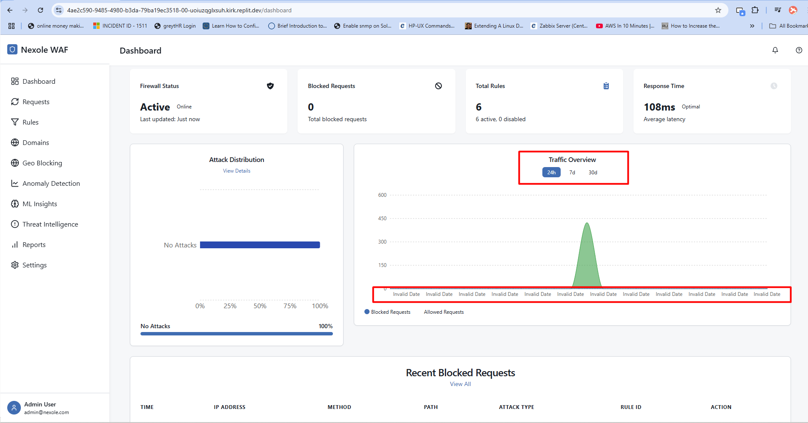

# Anomaly Detection Guide

## Overview

The Anomaly Detection page is designed to identify unusual patterns in web traffic that may indicate security threats. Using advanced statistical models and machine learning algorithms, this system can detect anomalies that traditional rule-based systems might miss, providing an additional layer of security for your web applications.

## Key Components

### 1. Anomaly Dashboard

The main dashboard displays a summary of detected anomalies and system status:

- **Anomaly Timeline**: Graph showing detected anomalies over time
- **Severity Distribution**: Breakdown of anomalies by severity level
- **Detection Status**: Health status of detection systems
- **Recent Detections**: List of most recently identified anomalies
- **False Positive Rate**: Current false positive metrics

### 2. Anomaly List

The central table displays all detected anomalies with key information:

- **Detection Time**: When the anomaly was detected
- **Anomaly Type**: Classification of the anomaly
- **Source**: Origin of the anomalous traffic
- **Target**: Affected domain/endpoint
- **Severity**: Impact rating (Critical, High, Medium, Low)
- **Confidence**: Detection confidence score
- **Status**: Current state (New, Investigating, Resolved, False Positive)
- **Actions**: Investigate, Mark as False Positive, Resolve, Create Rule

Anomalies are color-coded by severity and status for easy identification.

### 3. Anomaly Detail View

When selecting an anomaly, this panel shows comprehensive information:

- **Overview Tab**:
  - Detailed description of the anomaly
  - Related traffic patterns
  - Impact assessment
  - Suggested mitigation steps

- **Traffic Analysis Tab**:
  - Detailed traffic graphs around the anomaly
  - Comparison with baseline traffic
  - Related requests

- **Technical Details Tab**:
  - Raw detection data
  - Detection algorithm used
  - Feature contributions
  - Confidence metrics

- **Response Tab**:
  - Document investigation steps
  - Add notes and findings
  - Track resolution actions
  - Link to related incidents

### 4. Detection Configuration

This section allows administrators to configure the anomaly detection system:

- **Sensitivity Settings**: Adjust detection threshold sensitivity
- **Baseline Configuration**: Manage baseline traffic profiles
- **Detection Algorithms**: Enable/disable specific detection methods
- **Feature Selection**: Choose which traffic attributes to analyze
- **Learning Schedule**: Configure automatic model updates
- **Alerting Rules**: Set up notification conditions

### 5. Machine Learning Insights

This section provides information about the ML models and their performance:

- **Model Performance**: Accuracy, precision, and recall metrics
- **Feature Importance**: Which traffic attributes contribute most to detections
- **Learning Progress**: How the model is improving over time
- **Confusion Matrix**: False positive/negative analysis
- **Model Versions**: History of model updates and improvements

## Usage Tips

### Investigating Anomalies

When reviewing detected anomalies:

1. **Prioritize by Severity**: Address critical and high-severity anomalies first
2. **Examine Context**: Look at surrounding traffic for patterns
3. **Check Related Events**: Look for correlation with other security events
4. **Verify Impact**: Assess the potential damage if the anomaly is an attack
5. **Document Findings**: Record all investigation steps and conclusions

### Tuning the System

To improve detection accuracy:

1. **Start Conservative**: Begin with higher thresholds to reduce false positives
2. **Mark False Positives**: Consistently mark false detections to train the system
3. **Adjust Gradually**: Make incremental sensitivity adjustments
4. **Domain-Specific Tuning**: Configure different settings for different domains
5. **Regular Baseline Updates**: Update traffic baselines as your applications evolve

### Responding to Anomalies

Effective response strategies:

1. **Temporary Blocking**: Block suspicious IP addresses while investigating
2. **Pattern Recognition**: Create rules based on identified patterns
3. **Progressive Response**: Escalate response based on confidence level
4. **Correlation Analysis**: Link related anomalies for pattern detection
5. **Root Cause Analysis**: Identify and address underlying vulnerabilities

## Best Practices

1. **Regular Review**: Schedule time to review anomalies daily or weekly.

2. **Supervised Learning**: Actively provide feedback on detection accuracy to improve the system.

3. **Contextual Analysis**: Consider business contexts when evaluating anomalies (sales events, etc.).

4. **Integration**: Connect anomaly detection with your incident response workflows.

5. **Continuous Improvement**: Regularly evaluate and adjust detection parameters.

## Related Pages

- [Dashboard](./dashboard_guide.md) - For high-level security overview
- [ML Insights](./ml_insights_guide.md) - For deeper machine learning analysis
- [Rules](./rules_guide.md) - To create rules based on detected anomalies