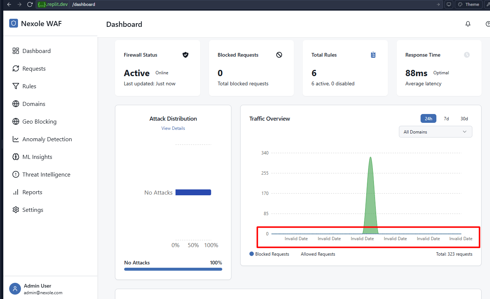

# Geo Blocking Guide

## Overview

The Geo Blocking page allows you to control access to your protected websites and applications based on geographic locations. By blocking or allowing traffic from specific countries or regions, you can significantly reduce attack surfaces and implement region-specific access policies.

## Key Components

### 1. Interactive World Map

The centerpiece of the page is an interactive world map that provides:

- Visual indication of blocked countries (red)
- Allowed countries (green)
- Countries in monitoring mode (yellow)
- Click-to-select functionality for adding/removing countries from block lists
- Hover tooltips with country-specific traffic statistics

### 2. Country Management Panel

This section lists all countries with their current status and controls:

- **Country Name**: Name of the country
- **Country Code**: ISO country code
- **Status**: Current status (Blocked, Allowed, Monitoring)
- **Traffic Volume**: Recent traffic volume from this country
- **Threat Level**: Calculated threat level based on past activities
- **Block/Allow Toggle**: Quick toggle to change country status
- **Rule Exceptions**: Indicator of any exception rules

### 3. Geo Rule Editor

When creating or editing geo-blocking rules, this interface allows you to:

- Select countries by clicking on the map or from a dropdown list
- Define exceptions for specific IP ranges within blocked countries
- Create time-based rules (block during specific hours)
- Set rules to apply to specific domains only
- Configure custom block page messages by region
- Create different policies for different types of content

### 4. Traffic Analysis

This section provides analytics on geographic traffic patterns:

- **Traffic Volume by Country**: Bar chart of request volume by country
- **Blocked Request Rate**: Percentage of blocked requests by region
- **Attack Origin Map**: Heat map showing attack origins
- **Unusual Traffic Alerts**: Notifications of abnormal traffic patterns by country

### 5. Geo Policy Templates

Quick-access templates for common geo-blocking scenarios:

- **US/EU Only**: Allow traffic only from United States and European Union
- **Block High-Risk Countries**: Block countries with high rates of attacks
- **GDPR Compliance**: Policies designed for European data protection compliance
- **Custom Regions**: Create and save custom regional groupings

## Usage Tips

### Implementing Geo Blocking

When setting up geo-blocking policies:

1. **Start with Monitoring**: Begin in monitoring-only mode to assess impact
2. **Be Selective**: Block only countries that show malicious activity
3. **Consider Legitimate Users**: Use exception rules for legitimate access needs
4. **Implement Gradually**: Roll out blocking in phases
5. **Monitor Effects**: Watch for changes in traffic patterns after implementation

### Creating Exception Rules

For more granular control:

1. **VPN and Proxy Awareness**: Create exceptions for known corporate VPN IP ranges
2. **Allowlist Trusted IPs**: Create explicit allowlist rules for trusted partners in blocked regions
3. **Path-Specific Rules**: Block countries only for sensitive areas of your application
4. **API vs. Website Differentiation**: Apply different policies to API endpoints versus website content
5. **Authentication-Based Exceptions**: Allow authenticated users from otherwise blocked regions

### Compliance Considerations

Ensure your geo-blocking policies align with:

1. **Business Requirements**: Market accessibility needs
2. **Legal Obligations**: Export control regulations
3. **Contractual Requirements**: Service Level Agreements
4. **Privacy Laws**: Data protection regulations
5. **Accessibility Standards**: Ensuring appropriate access

## Best Practices

1. **Data-Driven Decisions**: Base blocking decisions on threat intelligence rather than assumptions.

2. **Regular Review**: Periodically review and update your geo-blocking rules based on changing threat landscapes.

3. **Clear Messaging**: Provide clear information on block pages to legitimate users from blocked regions.

4. **Document Exceptions**: Maintain documentation of all exceptions and their justifications.

5. **Test From Multiple Regions**: Verify your geo-blocking implementation by testing access from different locations.

## Related Pages

- [Dashboard](./dashboard_guide.md) - For high-level security metrics
- [Threat Intelligence](./threat_intelligence_guide.md) - For threat data by region
- [Threat Map](./threat_map_guide.md) - For visualizing global threat patterns