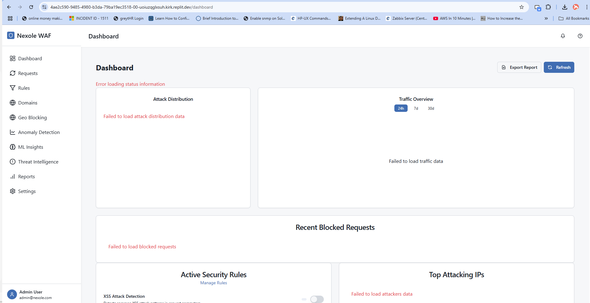

# Requests Guide

## Overview

The Requests page provides a comprehensive view of all HTTP traffic passing through the Nexole WAF. This page allows security administrators to monitor, filter, and analyze web requests in real-time or historically, helping to identify and investigate potential security threats.

## Key Components

### 1. Request Filtering Panel

Located at the top of the page, this panel allows you to filter requests based on various criteria:

- **Time Range**: Filter requests by specific time periods
- **Request Method**: Filter by HTTP method (GET, POST, PUT, DELETE, etc.)
- **Status Code**: Filter by HTTP response code (200, 404, 500, etc.)
- **IP Address**: Filter by source IP address
- **Domain**: Filter by targeted domain
- **Path**: Filter by requested URL path
- **Action**: Filter by WAF action (allowed, blocked, flagged)
- **Rule Match**: Filter by triggered security rule

### 2. Request List

The main table displays all requests matching your filter criteria, showing key information for each request:

- **Timestamp**: When the request was received
- **IP Address**: The source IP address
- **Method**: HTTP request method
- **Domain**: The targeted domain
- **Path**: The requested URL path
- **Status**: HTTP response status code
- **Response Time**: Time taken to process the request
- **Size**: Size of the response in bytes
- **Action**: Action taken by the WAF (allowed, blocked, flagged)
- **Rule Match**: Security rule that triggered (if any)

### 3. Request Detail Panel

When you select a request from the list, this panel displays detailed information about that specific request:

- **General Information**:
  - Full request URL
  - Client information (browser, OS, device)
  - Geolocation data
  - TLS/SSL information

- **Headers Tab**: All HTTP request and response headers

- **Parameters Tab**: Query parameters and form data

- **Body Tab**: Request and response body content

- **Security Tab**:
  - Matching rules details
  - Risk score calculation
  - Threat intelligence data
  - Anomaly detection results

### 4. Action Buttons

These buttons allow you to take actions on selected requests:

- **Block IP**: Add the source IP to the blocklist
- **Add to Watchlist**: Monitor the IP address more closely
- **Export**: Download request details in various formats
- **Create Rule**: Generate a new security rule based on this request

## Usage Tips

### Advanced Filtering

Beyond the basic filters, you can use advanced query syntax in the search bar:

- Use quotes for exact phrase matching: `"POST /api/login"`
- Use operators for numerical values: `status >= 400`
- Use boolean operators: `method:POST AND path:*/admin*`
- Use negation: `NOT ip:192.168.1.*`

### Investigating Attacks

When investigating a potential attack:

1. Start by filtering for blocked requests or high-risk scores
2. Examine the pattern of requests from suspicious IPs
3. Review headers and payloads for malicious content
4. Check if multiple domains are being targeted
5. Use the "Related Requests" feature to find similar traffic

### Threat Hunting

For proactive threat hunting:

1. Look for unusual patterns in allowed traffic
2. Filter for specific attack vectors (SQL injection paths, etc.)
3. Review requests with high response times (potential DoS attempts)
4. Look for reconnaissance patterns (scanning behavior)

### Exporting Data

The export functionality allows you to:

- Export selected requests or filtered views
- Choose format (CSV, JSON, PCAP)
- Include or exclude specific fields
- Set up automatic exports for compliance records

## Best Practices

1. **Regular Review**: Schedule time to review request logs daily or weekly.

2. **Progressive Analysis**: Start with broad filters, then progressively narrow down to specific patterns.

3. **Baseline Awareness**: Understand your normal traffic patterns to better identify anomalies.

4. **Correlation**: Correlate request data with other security events from external systems.

5. **Documentation**: Use the annotation feature to document findings for security incidents.

## Related Pages

- [Dashboard](./dashboard_guide.md) - For high-level security overview
- [Rules](./rules_guide.md) - To manage security rules triggered by requests
- [Anomaly Detection](./anomaly_detection_guide.md) - For automated detection of suspicious traffic patterns