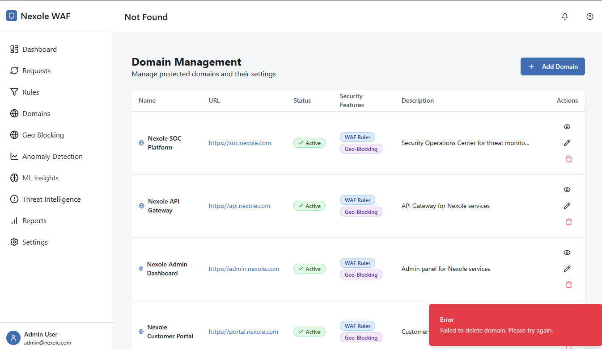

# Rules Guide

## Overview

The Rules page is where you define, manage, and monitor the security rules that govern how the Nexole WAF processes and filters web traffic. These rules determine which requests are allowed, blocked, or flagged for review based on various security criteria.

## Key Components

### 1. Rule List

The main table displays all configured security rules with key information about each rule:

- **Name**: Unique identifier for the rule
- **Description**: Brief explanation of the rule's purpose
- **Category**: Classification of the rule (SQL Injection, XSS, etc.)
- **Status**: Current state (Active, Disabled, Monitor Mode)
- **Priority**: Execution order priority
- **Hit Count**: Number of times the rule has matched requests
- **Last Match**: Timestamp of the most recent match
- **Actions**: Edit, Duplicate, Delete, Enable/Disable

Rules are color-coded by severity:
- Critical (Red)
- High (Orange)
- Medium (Yellow)
- Low (Blue)
- Informational (Gray)

### 2. Rule Management Panel

This section provides controls for managing the rule set:

- **Create Rule**: Opens the rule editor to create a new rule
- **Import Rules**: Import rules from file or templates
- **Export Rules**: Export all or selected rules
- **Bulk Actions**: Enable, disable, or delete multiple rules
- **Rule Search**: Find rules by name, description, or content

### 3. Rule Editor

When creating or editing a rule, this panel provides a comprehensive interface for defining rule logic:

- **Basic Properties**:
  - Name and description
  - Status (Active, Disabled, Monitor Mode)
  - Priority level
  - Severity rating
  - Category assignment

- **Matching Conditions**:
  - Request method selection
  - URL pattern matching
  - Header inspection rules
  - Parameter checks
  - Body content analysis
  - Regular expression support

- **Advanced Properties**:
  - Custom scoring logic
  - Rate limiting parameters
  - Target domain restrictions
  - Virtual patching options
  - Logging preferences

- **Actions**:
  - Action to take when rule matches (Allow, Block, Log, Challenge)
  - Custom response configuration
  - Alert notifications
  - Integration with external systems

### 4. Rule Testing Tool

This tool allows you to test rules against sample requests before activating them in production:

- **Request Builder**: Create test requests with custom headers, parameters, etc.
- **Rule Selector**: Choose which rules to test
- **Test Results**: View matching results and rule evaluation details
- **Performance Metrics**: Assess rule processing time and efficiency

### 5. Rule Performance Dashboard

This section provides analytics on rule effectiveness:

- **Top Triggered Rules**: Most frequently matched rules
- **False Positive Rates**: Rules with high rates of false positives
- **Rule Coverage**: Analysis of protection coverage
- **Rule Processing Time**: Performance impact of individual rules

## Usage Tips

### Creating Effective Rules

When creating new security rules:

1. **Be Specific**: Target specific attack vectors rather than creating overly broad rules
2. **Use Context**: Consider the application context (URLs, parameters) for better accuracy
3. **Test Thoroughly**: Always test rules against legitimate traffic before enabling
4. **Document Purpose**: Add detailed descriptions and references for future understanding
5. **Consider Performance**: Complex regex patterns can impact performance

### Rule Organization

Best practices for organizing your ruleset:

1. **Use Categories**: Group related rules by attack type or application area
2. **Prioritize Properly**: Set priorities to ensure efficient rule processing
3. **Use Tags**: Add tags for easier filtering and organization
4. **Create Rule Sets**: Group rules into sets for different applications or environments
5. **Version Control**: Track rule changes and maintain version history

### Advanced Rule Features

Take advantage of these advanced capabilities:

1. **Variable Extraction**: Extract values from requests for use in other rules
2. **Chained Rules**: Create rule chains for complex detection scenarios
3. **Transformation Functions**: Apply transformations to improve detection (lowercase, URL decode, etc.)
4. **Rule Exceptions**: Define exceptions to prevent blocking legitimate traffic
5. **Custom Scripts**: Write custom logic for complex detection scenarios

## Best Practices

1. **Start with Core Protections**: Begin with rules for OWASP Top 10 vulnerabilities.

2. **Layer Your Defenses**: Use multiple rules that address different aspects of the same attack vector.

3. **Monitor Before Blocking**: Use monitor mode for new rules to assess impact before blocking.

4. **Regular Review**: Periodically review rule effectiveness and false positive rates.

5. **Update Regularly**: Keep rules updated with new attack patterns and techniques.

## Related Pages

- [Dashboard](./dashboard_guide.md) - For high-level security metrics
- [Requests](./requests_guide.md) - To view traffic filtered by these rules
- [Threat Intelligence](./threat_intelligence_guide.md) - For integration with threat intelligence