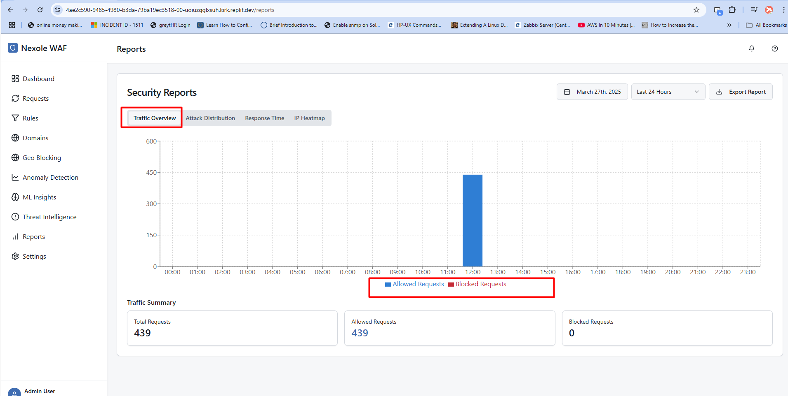

# Threat Intelligence Guide

## Overview

The Threat Intelligence page provides comprehensive insights into potential security threats targeting your web applications. By integrating data from multiple threat feeds and internal analysis, this page helps security administrators identify, analyze, and respond to emerging threats before they impact your systems.

## Key Components

### 1. Threat Summary Dashboard

The main dashboard displays high-level metrics and recent threat activity:

- **Threat Level Indicator**: Current overall threat level
- **Recent Threat Activity**: Timeline of detected threats
- **Top Threat Categories**: Distribution of threats by type
- **Geographic Origin Map**: Visual representation of threat origins
- **Feed Status**: Health status of connected threat intelligence feeds

### 2. IP and Domain Lookup

This tool allows you to investigate specific IPs or domains:

- **IP Lookup**: Search for an IP address to view threat information
- **Domain Lookup**: Search for domain reputation and threat data
- **Comprehensive Results**: View aggregated data from multiple sources
- **Historical Context**: View historical threat activity
- **One-Click Actions**: Block, monitor, or whitelist from results page

### 3. Threat Feeds Management

This section allows you to manage the threat intelligence sources:

- **Active Feeds**: List of currently connected intelligence feeds
- **Feed Details**: Source information, update frequency, coverage
- **Feed Health**: Status indicators for each feed
- **Configuration**: Connection settings and API credentials
- **Manual Refresh**: Force update specific feeds

### 4. Threat Entries List

This table displays individual threat indicators with detailed information:

- **Indicator**: The specific IP, domain, hash, or pattern
- **Type**: Type of indicator (IP, URL, File Hash, etc.)
- **Confidence**: Confidence score of the threat assessment
- **Severity**: Impact rating of the threat
- **Source**: Origin of the threat intelligence
- **First Seen**: When the threat was first detected
- **Last Seen**: Most recent detection of the threat
- **Actions**: Block, Whitelist, Export, Create Rule

### 5. Insights Panel

This section provides analytical tools for threat investigation:

- **Threat Correlation**: Relationships between different threats
- **Attack Campaign Analysis**: Identification of coordinated attacks
- **Trend Analysis**: Changes in threat landscape over time
- **Predictive Indicators**: Early warning signs of potential attacks
- **Mitigation Recommendations**: Suggested response strategies

## Usage Tips

### Effective Threat Investigation

When investigating potential threats:

1. **Cross-Reference Sources**: Check multiple intelligence feeds for consensus
2. **Consider Context**: Evaluate threats in relation to your specific environment
3. **Follow the Chain**: Track relationships between threats to identify campaigns
4. **Verify Before Action**: Confirm indicators before implementing blocks
5. **Document Findings**: Record investigation steps and conclusions

### Optimizing Threat Feed Configuration

To get the most from threat intelligence:

1. **Quality Over Quantity**: Focus on reliable, high-confidence feeds
2. **Sector-Specific Intelligence**: Prioritize feeds relevant to your industry
3. **Balance Update Frequency**: Consider both real-time and curated feeds
4. **Tune Confidence Thresholds**: Adjust minimum confidence levels for actions
5. **Regular Feed Assessment**: Periodically evaluate feed performance

### Threat Response Workflow

Recommended response process:

1. **Initial Assessment**: Evaluate threat severity and confidence
2. **Correlation**: Check for related indicators or patterns
3. **Contextual Analysis**: Consider impact on your specific environment
4. **Graduated Response**: Implement appropriate countermeasures
5. **Feedback Loop**: Document effectiveness of response

## Best Practices

1. **Actionable Intelligence**: Focus on threat data that can drive specific security actions.

2. **Confidence Scoring**: Implement and use confidence ratings to prioritize response.

3. **Threat Contextualization**: Apply local context to global threat intelligence.

4. **Regular Review**: Schedule time to review threat trends and adjust defenses.

5. **Integration**: Connect threat intelligence with your security operations workflow.

## Related Pages

- [Dashboard](./dashboard_guide.md) - For high-level security overview
- [Rules](./rules_guide.md) - To create rules based on threat intelligence
- [Threat Map](./threat_map_guide.md) - For geographic visualization of threats