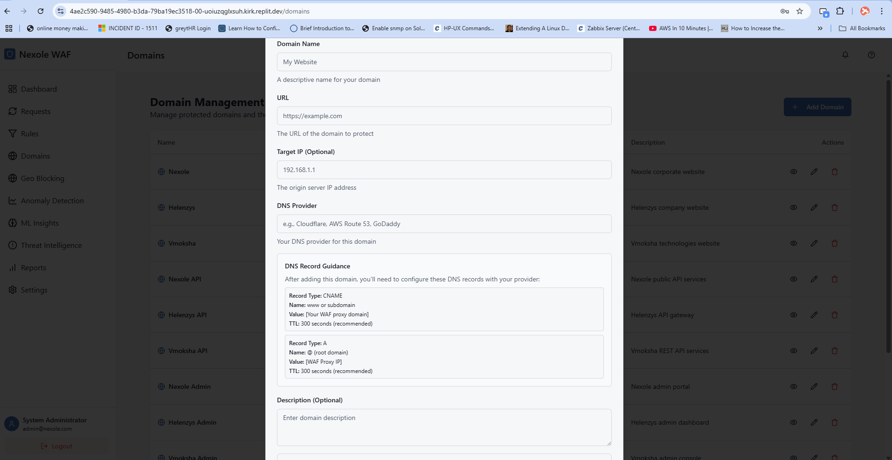

# Threat Map Guide

## Overview

The Threat Map page provides a dynamic, real-time visualization of global security threats targeting your protected domains. This intuitive geographic display helps security administrators identify attack patterns, monitor emerging threats, and understand the global distribution of malicious activity.

## Key Components

### 1. Interactive World Map

The centerpiece of the page is a dynamic world map showing:

- **Attack Origins**: Points or heat maps showing source locations of attacks
- **Target Indicators**: Markers showing your protected assets
- **Attack Intensity**: Color gradients showing attack volume by region
- **Attack Types**: Different visualizations for various attack categories
- **Real-time Animation**: Visual traces showing attack paths in motion

The map supports zooming, panning, and filtering for detailed analysis of specific regions.

### 2. Threat Activity Panel

This section displays real-time and historical threat metrics:

- **Current Activity**: Live counter of ongoing attacks
- **24-Hour Summary**: Attack volume trends over the past day
- **Top Attack Sources**: Countries generating the most attack traffic
- **Top Attack Types**: Most common attack categories detected
- **Protected Domains Impact**: Which of your domains are receiving the most attacks

### 3. Attack Detail Feed

This real-time feed shows individual attack events as they occur:

- **Timestamp**: When the attack was detected
- **Source IP and Location**: Origin of the attack
- **Target Domain**: Which domain was targeted
- **Attack Type**: Category of the attack attempt
- **Severity**: Impact rating of the attack
- **Response**: Action taken by the WAF

Clicking on an attack entry zooms the map to the relevant location and provides detailed information.

### 4. Filter and View Controls

These controls allow you to customize the map visualization:

- **Time Range**: View current activity or historical data
- **Attack Types**: Filter to show specific categories of attacks
- **Severity Filter**: Focus on attacks of particular severity levels
- **Source Regions**: Filter by attacking country or region
- **Target Domains**: Filter to specific protected domains
- **Visualization Mode**: Switch between different map styles (points, heat map, connections)

### 5. Analytics and Insights

This section provides analytical tools for understanding attack patterns:

- **Attack Trend Analysis**: How attack patterns have changed over time
- **Geographic Correlation**: Relationships between attack sources
- **Predictive Indicators**: Potential emerging threat sources
- **Unusual Activity Alerts**: Notifications of abnormal patterns

## Usage Tips

### Understanding the Visualization

The map uses various visual elements to represent threat data:

1. **Color Intensity**: Brighter colors indicate higher attack volume
2. **Dot Size**: Larger dots represent more attacks from that location
3. **Connection Lines**: Lines show attack paths from source to target
4. **Pulsing Animation**: Speed indicates attack frequency
5. **Icon Variation**: Different icons represent different attack types

### Threat Intelligence Gathering

Use the map for these intelligence gathering activities:

1. **Trend Identification**: Spot emerging attack sources
2. **Campaign Recognition**: Identify coordinated attacks from multiple sources
3. **Geographic Profiling**: Understand which regions pose the greatest threat
4. **Attack Pattern Analysis**: Recognize timing patterns in attacks
5. **Target Profiling**: See which of your assets are most targeted

### Response Coordination

The map can guide security response efforts:

1. **Prioritize Defenses**: Focus on the most actively targeted areas
2. **Geo-Blocking Decisions**: Make informed decisions about country-level blocking
3. **Resource Allocation**: Direct security resources to the most threatened assets
4. **Executive Reporting**: Use the visualization for clear communication with leadership
5. **Threat Hunting**: Guide proactive threat hunting activities

## Best Practices

1. **Regular Monitoring**: Schedule time to observe the threat map daily.

2. **Pattern Recognition**: Look for unusual patterns or sudden changes in attack sources.

3. **Contextual Analysis**: Correlate map activity with global events or security news.

4. **Historical Comparison**: Compare current activity with historical patterns to identify anomalies.

5. **Coordinate Response**: Use the map to coordinate defense strategies across security teams.

## Related Pages

- [Dashboard](./dashboard_guide.md) - For high-level security overview
- [Geo Blocking](./geo_blocking_guide.md) - To implement geographic access controls
- [Threat Intelligence](./threat_intelligence_guide.md) - For detailed threat analysis